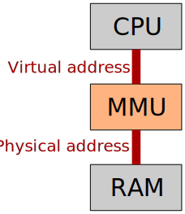

{}

_(This article is only available in French / Cet article n'est disponible qu'en français)_

{}

La mémoire virtuelle est un composant important des systèmes d'exploitation modernes. Sans lui,
il est très difficile de permettre à plusieurs processus de cohabiter de manière sûre.

La mémoire virtuelle est géréé par le «MMU» (Memory Management Unit). Le MMU est un composant matériel
qui se trouve entre le CPU et la RAM.
Il reçoit une **adresse virtuelle** du CPU et la convertit en **adresse physique** vers la RAM :

Sur les systèmes modernes, la largeur du bus d'adresse virtuelle est généralement la même que la largeur
du bus physique (souvent 32 ou 64 bit), mais sur les systèmes plus anciens, il n'était pas rare
d'avoir un espace d'adressage différent pour les adresses virtuelles que pour les adresses physiques.
Le Commodore 64 par exemple utilisait le chip SN54LS612 qui permettait d'avoir des adresses virtuelles
sur 16 bits (64kB) et des adresses physiques sur 24 bits (16MB).

Pour la suite, nous supposons que la largeur du bus d'adresse virtuelle est la même que la largeur
du bus physique et que cette largeur est de $sy$ bytes.

## Les pages

Le système de mémoire virtuelle considère que la mémoire est structurée en **pages**. Souvent, la
taille des pages est de 4 kBytes, mais on trouve parfois aussi d'autres tailles de page. La taille
d'une page est toujours une puissance de 2! Pour la suite, nous considérons que les pages font $2^{of}$ Bytes.

Toutes les adresses mémoires (entre $0$ et $2^{sy}-1$) peuvent être décomposées en un _numéro de page_
et un _offset_ à l'intérieur de la page.

Exemple: Si on a des pages de 4 kByte ($= 4096$ $= 2^{12}$), l'adresse $0x706c$ ($28780$ en base 10)
se situe sur la **page 7**

$$\left\lfloor\frac{28780}{4096}\right\rfloor = 7$$

et l'offset (c'est à dire la position de l'adresse dans la page) est de **108** (ou $0x6c$ en hexadécimal)

$$28780\ mod\ 4096 = 108$$

L'adresse $0x706c$ est donc à l'offset $0x6c$ de la page $7$.

Comme la taille de la page est de $2^{of}$, l'offset se lit simplement sur les $of$ derniers bits et le
numéro de page se trouve sur les $sy - of = pg$ bits de poid fort:

La page est l'unité de gestion de la mémoire virtuelle et quand on convertit une adresse virtuelle,
on convertit en fait **la page** virtuelle en **page** physique. Comme la taille des pages est la
même pour les adresses virtuelles et les adresses physiques, l'offset *reste le même* dans les deux
cas.

## La table de conversion de pages

Les premiers MMU utilisaient leur propre mémoire interne pour la traduction des pages virtuelles
en pages physiques, mais avec les systèmes modernes (32 bits et plus), on utilise la RAM du système
pour stocker la table de conversion des pages.

La table est composée **d'entrées**. Chaque entrée contient les informations suivantes:

* le (ou les) «flag(s)» de contrôle du cache (1 bit).
* les «flags» _référencé_ et _modifié_ (2 bits).
* les bits de gestion des protections (1-3 bits).
* un «flag» qui indique si la page est présente ou non (1 bit).
* le numéro de la page physique correspondante ($pg$ bits).

La taille d'une entrée est donc de :

$$1+2+3+1+pg = pg+7 bits$$

Si on reprend notre système 32 bits avec des pages de 4kByte, on aura besoin de $32-12+7 = 27 bits$.
On va donc considérer que dans ce cas précis, les entrées de la table de pages auront 32 bits (ou 4 Bytes).
Pour la suite, on notera $es$ la taille (en Byte) d'une entrée de table de pages.

Comme la mémoire est structurée en pages, il est intéressant de faire tenir la table de pages
à l'intérieur d'une page. Dans une page (de taille de $2^{of}$), on peut donc mettre une table de $2^{of} \div es$ entrées.

Si on reprend notre exemple de système 32 bits avec des pages de 4 kBytes et des entrées de table de
page sur 4 bytes, on pourra mettre une table de 1024 entrées dans la page:

$$\frac{2^{12}}{4} = 2^{10} = 1024$$

Le problème c'est que sur notre système 32 bits, on à $2^{32-12} = 2^{20} = 1048576$ pages et non $1024$.

Une solution c'est d'utiliser des pages sur plusieurs niveaux. Reprenons notre système 32 bits, si on garde des
pages de 4 kByte, et qu'on travaille avec des tables sur 2 niveaux, on va mettre une table de premier niveau
avec 1024 entrées, et les tables de 2ème niveau également avec 1024 entrées. En tout on aura donc
$1024 \cdot 1024 = 2^{20} = 1048576$ entrées. C'est exactement ce dont on a besoin (car dans notre
exemple $pg = 20$).

Vous trouverez plus d'information sur la mémoire virtuelle sur [wikipedia](https://fr.wikipedia.org/wiki/M%C3%A9moire_virtuelle)

